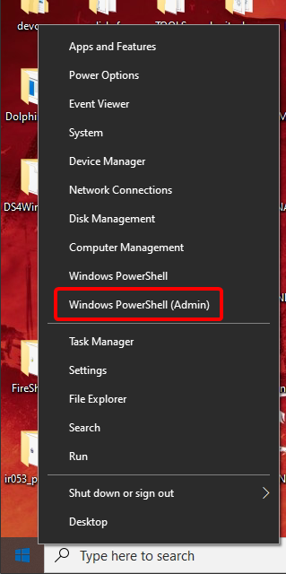
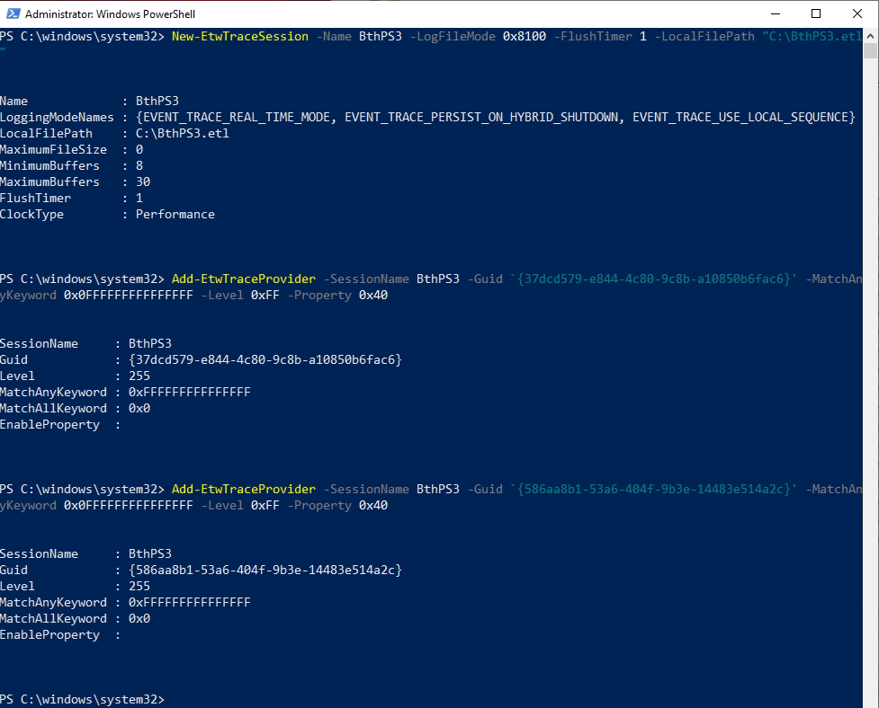
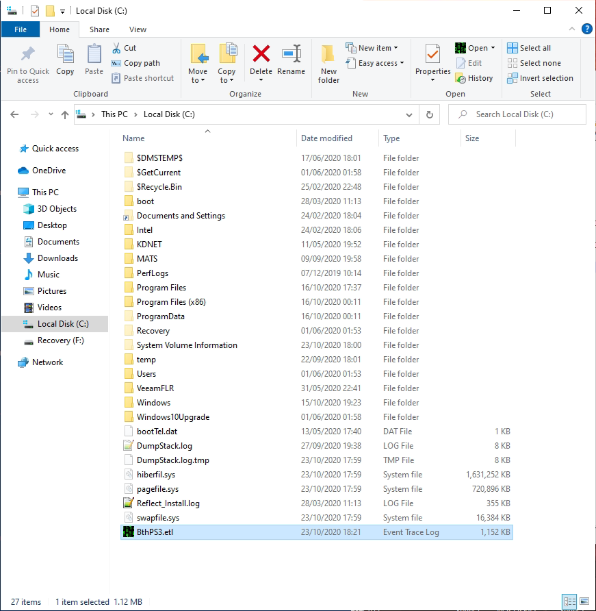
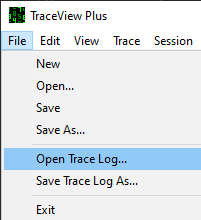
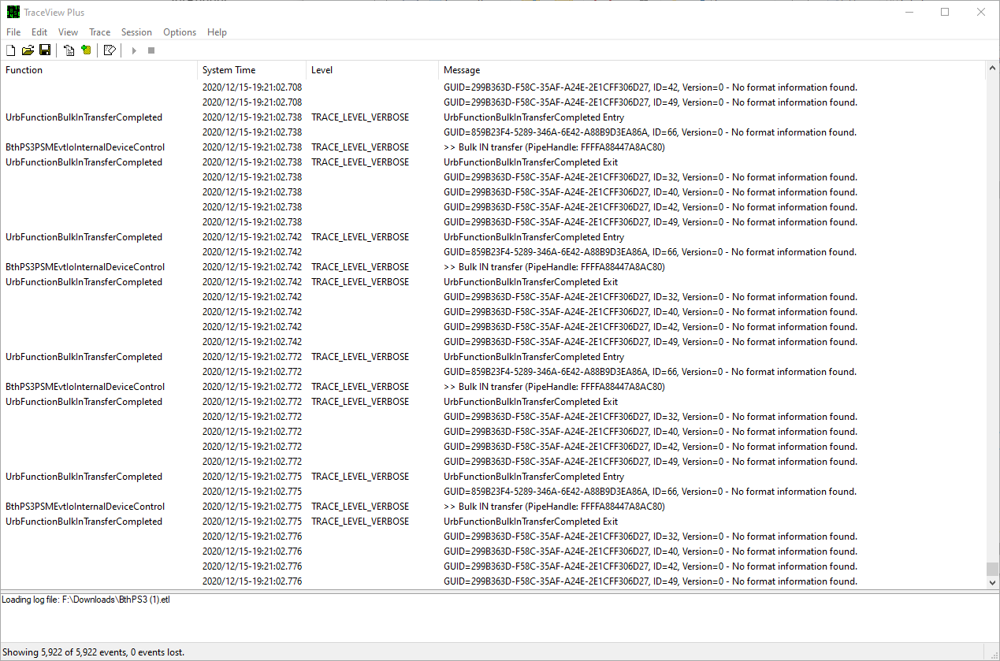
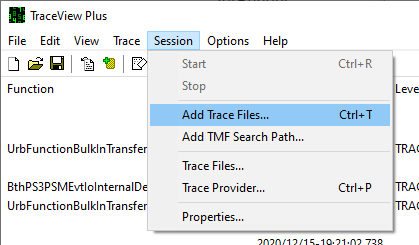
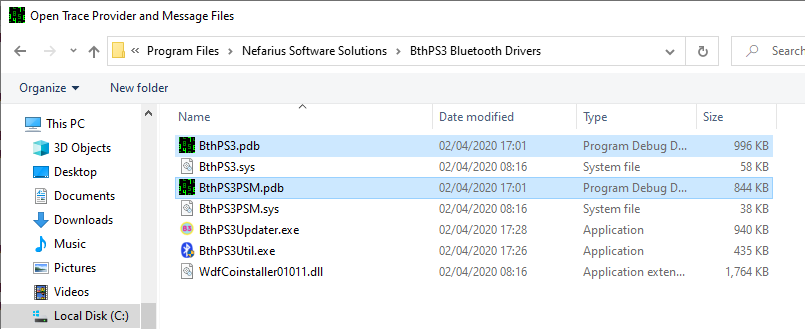
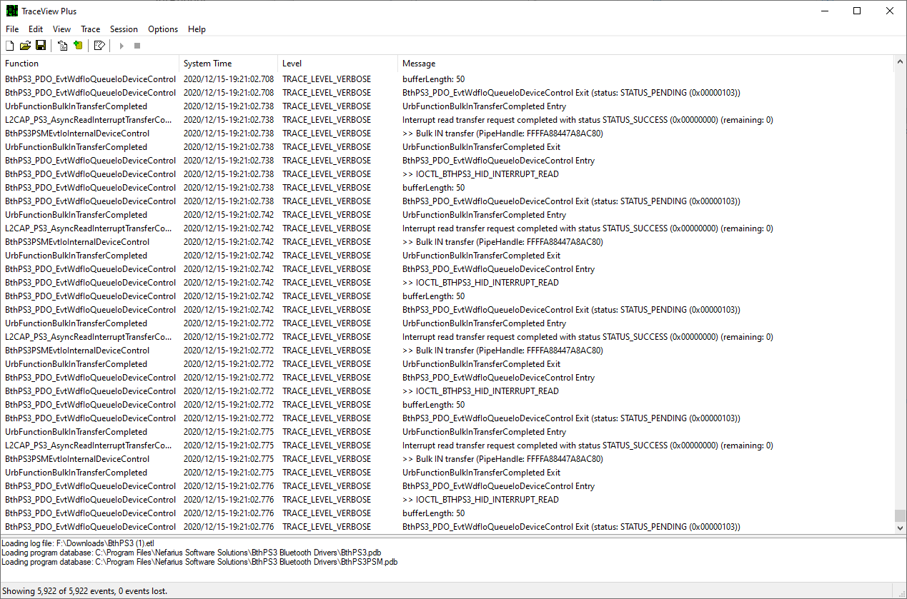

# Debugging the Drivers

Kernel drivers do not write normal log files to disk. Instead, they use [Event Tracing for Windows](https://docs.microsoft.com/en-us/windows-hardware/test/wpt/event-tracing-for-windows) (ETW), which you can capture from the command line.

## Prepare verbose tracing

1. Open **PowerShell as Administrator** (press ++win+x++ and choose it from the menu):

    

    Keep this window open; you will use it for the following steps.

2. By default, verbose tracing is **off**. To enable it, run these commands in PowerShell:

    !!! example "PowerShell"
        ```PowerShell
        Set-ItemProperty -Path "HKLM:\SYSTEM\CurrentControlSet\Services\BthPS3\Parameters" -Name "VerboseOn" -Type DWord -Value 1 -Force
        Set-ItemProperty -Path "HKLM:\SYSTEM\CurrentControlSet\Services\BthPS3\Parameters\Wdf" -Name "VerboseOn" -Type DWord -Value 1 -Force
        Set-ItemProperty -Path "HKLM:\SYSTEM\CurrentControlSet\Services\BthPS3PSM\Parameters" -Name "VerboseOn" -Type DWord -Value 1 -Force
        Set-ItemProperty -Path "HKLM:\SYSTEM\CurrentControlSet\Services\BthPS3PSM\Parameters\Wdf" -Name "VerboseOn" -Type DWord -Value 1 -Force
        ```

3. **Reboot** the machine before continuing.

You only need to do this once; later trace sessions do not require another reboot.

## Capture the trace

### Start trace session

In PowerShell (as Administrator), run these three commands:

!!! example "PowerShell"
    ```PowerShell
    New-EtwTraceSession -Name BthPS3 -LogFileMode 0x8100 -FlushTimer 1 -LocalFilePath "C:\BthPS3.etl"
    Add-EtwTraceProvider -SessionName BthPS3 -Guid '{37dcd579-e844-4c80-9c8b-a10850b6fac6}' -MatchAnyKeyword 0x0FFFFFFFFFFFFFFF -Level 0xFF -Property 0x40
    Add-EtwTraceProvider -SessionName BthPS3 -Guid '{586aa8b1-53a6-404f-9b3e-14483e514a2c}' -MatchAnyKeyword 0x0FFFFFFFFFFFFFFF -Level 0xFF -Property 0x40
    ```

The output should look similar to this (it may differ on your system):



### Reproduce the behaviour you want to capture

While the trace is running, perform the actions you want to investigate. For example:

- **Controller not connecting over Bluetooth:** Try connecting it several times (turn on with the PS button, wait until the LEDs stop blinking, then try again).
- **Controller turning off randomly:** Use the controller until it disconnects on its own.
- **Something works over USB but not Bluetooth (e.g. LEDs, rumble, sticks):** Repeat the same actions over Bluetooth that work over USB.

### Stop the trace session

When you have captured enough, stop the session so the log file is closed:

!!! example "PowerShell"
    ```PowerShell
    Remove-EtwTraceSession -Name BthPS3
    ```

The log file will be at `C:\BthPS3.etl`:



## What to do with the trace file

You now have a `BthPS3.etl` file. You can submit it (compressed with WinRAR or 7-Zip) to Nefarius for analysis, or inspect it yourself as described below.

!!! note "Trace file contents"
    The trace file may contain device identifiers needed for debugging. Share it securely with trusted recipients only.

## Decoding the trace file

Trace files are not plain text. You need a tool that can decode ETW content. Microsoft provides such tools, but they are verbose and not very beginner-friendly; a third-party tool is recommended.

### Using MGTEK TraceView Plus 3

1. Download and install [MGTEK TraceView Plus 3](https://www.mgtek.com/traceview).

!!! important "MGTEK TraceView Plus 3 is not freeware"
    A free 30-day evaluation is available. For longer use, you can [purchase a licence](https://www.mgtek.com/traceview/shop).

2. Double-click `BthPS3.etl` to open it in TraceView Plus, or use **File** → **Open Trace Log...** and select the file:  
   

3. Initially you will see raw, hard-to-read lines:  
   

4. TraceView Plus needs symbol files to decode the trace. Go to **Session** → **Add Trace Files...**:  
   

5. In the BthPS3 installation folder on your system, select **both** PDB files:  
   

6. The display should switch to readable text:  
   

You can then browse the trace; newest events are at the bottom, oldest at the top.

## Interpreting the trace

Once the trace is decoded, look for `TRACE_LEVEL_WARNING` or `TRACE_LEVEL_ERROR` entries. These indicate driver failures and can point to the cause of connection or behaviour issues. Whether the issue can be fixed depends on the specific message and your setup.

Also look at the structured events below. **BthPS3 v3.1** and **v3.2** added correlatable events for PSM registration, remote connect, filter initialization, and BTHX transport. They show up in the same `.etl` once symbols (or the installed manifests) are applied.

## Interpreting common events

These names come from the shipped manifests (`BthPS3.man`, `BthPS3PSM.man`). You do not need every line; use the table to tell expected noise from a real failure.

### Profile driver (`BthPS3`)

| Event | What it means |
| --- | --- |
| `RemoteConnectReceived` | An inbound L2CAP connect reached the profile driver (address + PSM). |
| `PsmRegistrationSucceeded` / `PsmRegistrationFailed` | HID Control / Interrupt PSM listen was registered or failed. A failure here means PS3 peripherals cannot connect. |
| `PsmRegistrationStale` / `PsmRegistrationDeferred` / `PsmRegistrationRecovered` | A previous listen was still committed; the driver reclaims it and retries. Recovery is success. |
| `RemoteDeviceName` / `RemoteDeviceIdentified` / `RemoteDeviceNotIdentified` | The remote Bluetooth name was read and matched (or not) against the supported-name lists. An empty name followed by "not identified or denied" is a firmware/radio problem on the pad. See [The controller tries to connect, then BthPS3 drops it](Frequently-Asked-Questions.md#the-controller-tries-to-connect-then-bthps3-drops-it). |
| `HidControlChannelConnected` / `HidInterruptChannelConnected` / `HidChannelConnectedDetailed` | The two HID channels came up. |
| `RemoteDeviceOnline` | Both channels are up; the pad is ready. |
| `RemoteDisconnectCompleted` / `RemoteL2capDisconnected` | The remote went away (status or channel). |
| `PowerPolicyIdleSettingsFailed` | **Informational.** Idle settings were left unchanged because BthPS3 does not own the device power policy and the device is not in RAW mode. **This is expected when DsHidMini is installed.** It is not a failure. |
| `WdfDeviceAssignS0IdleSettingsFailed` | A real power-policy assignment error (different from the informational skip above). |

### Filter driver (`BthPS3PSM`)

| Event | What it means |
| --- | --- |
| `TransportTypeDetected` | The radio was classified as USB (`1`) or BTHX (`2`). |
| `FilterDeviceInitialized` | Filter init succeeded for that instance (transport, patch status, NTSTATUS). Logged only on success. |
| `PsmPatchActivity` / `PsmPatchActivityDetailed` | An L2CAP connection request was seen and optionally rewritten. Use these when PSM patching looks off. |
| `UnsupportedTransportType` | The radio is neither USB nor BTHX; the filter will not attach. Matches [setup error 9004](Frequently-Asked-Questions.md#how-do-i-fix-setup-error-9004). |
| `BthxAclDataRejected` | A BTHX ACL completion reported an implausible length. Host-stack / radio noise; collect the trace if it repeats around a failed connect. |
| `FailedToFindBulkInPipe` / `HookSendFailed` | The USB or BTHX hook could not be installed or a hooked send failed. Patching will not work until this is resolved. |

!!! note "PSM patching and traces"
    Filter options in the [Driver Configuration Utility](Driver-Configuration-Utility-Explained.md#enable-psm-patching) are what you change; these events are how you confirm the filter actually saw and rewrote a connect.
