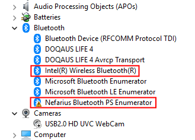

# Frequently Asked Questions

Answers to common questions about BthPS3.

## How do I fix the "Bluetooth Host Radio not found" setup message?

> Bluetooth Host Radio not found. A working Bluetooth stack is required for driver installation or removal.


Your Bluetooth stack is not working or not available. If you are on a laptop, make sure wireless is not disabled (physical switch or key combination—depends on the model). On a desktop, ensure a Bluetooth dongle is plugged in. If you had ScpToolkit, AirBender, or similar solutions installed, remove them completely and use stock drivers. If you do not see the Bluetooth icon in the taskbar, Bluetooth is likely off or not working. Fix the Bluetooth stack and run setup again.

## How do I fix "previous version found" on reinstall?

If you see this setup error:


and cannot get past it, do the following:

1. Open **Command Prompt**, **PowerShell**, or **Terminal** as Administrator.
   
2. Change to the folder where you downloaded the setup (for example, `F:\Downloads`). Replace the path with your own:
   - `cd "F:\Downloads\"`
   - Example: `cd "C:\Users\<YourUsername>\Downloads"`
3. Run the setup with the bypass flag:
   - `.\BthPS3Setup_x64.msi FILTERNOTFOUND="1"`

The setup should then launch. Follow the installer instructions to complete.

## How do I fix Bluetooth device error codes 19, 31, 37, 39, or 43?

If you have a damaged or partial installation, the setup or uninstaller may not run. If Device Manager shows a yellow exclamation mark on your Bluetooth host with an error code such as:


you can try the following fix.

Open **PowerShell as Administrator** and run:

!!! example "PowerShell"
    ```PowerShell
    Remove-ItemProperty -Path 'HKLM:\SYSTEM\CurrentControlSet\Control\Class\{e0cbf06c-cd8b-4647-bb8a-263b43f0f974}' -Name 'LowerFilters'
    ```

This removes the filter driver requirement that may be blocking the radio from starting. Then power-cycle the Bluetooth radio or reboot. You may also need to uninstall and reinstall BthPS3 to fully resolve the issue.

## What to do about error Code 10 (`STATUS_DEVICE_POWER_FAILURE`)

> This device cannot start. (Code 10)


Your Bluetooth host dongle or card is too old or incompatible. There is no software fix; you will need to use a different Bluetooth host.

### What about Code 10 "The specified request is not a valid operation for the target device"?


Your Bluetooth host is incompatible with BthPS3. There is no software fix; use a different Bluetooth host.

## What Bluetooth hosts are supported?

In short: most hosts from the last decade that run stock drivers (no ScpServer/ScpToolkit, no AirBender). For a list of tested devices, see [Compatible Bluetooth devices](Compatible-Bluetooth-Devices.md).

!!! warning "USB only"
    Only Bluetooth host radios that use **USB** are supported. This includes most external dongles and many integrated cards. Hosts that use I²C or UART (for example, on Raspberry Pi or Steam Deck) are **not** supported.

## What controllers are supported?

!!! important "TL;DR"
    Genuine Sony hardware is the target; third-party controllers may or may not work.

These drivers are designed for the **original Sony SIXAXIS/DualShock 3** (and Navigation and Move) controllers within the limits of the Microsoft Bluetooth stack. Many third-party and clone DualShock 3–compatible devices exist; some behave like the original, others do not. Aftermarket devices often spoof the hardware identification that Windows sees, so there is no reliable way to guarantee support for all of them. For more detail, see [About controller compatibility](About-Controller-Compatibility.md).

## Can I use my wireless keyboard, mouse, or headphones with BthPS3?

Yes. BthPS3 **extends** the existing Windows Bluetooth stack; it does **not** replace it (unlike ScpToolkit and similar tools). Your normal Bluetooth devices keep working. The trade-off is that BthPS3 cannot fully mimic the original PlayStation Bluetooth stack, but you retain standard wireless functionality.

## Can I use other wireless controllers alongside the DualShock 3?

Yes. Any PC-compatible Bluetooth device works with BthPS3. You can use a DualShock 3 over Bluetooth at the same time as other wireless controllers.

## How many devices can I connect at the same time?

There is no fixed limit. It depends on your Bluetooth host (quality, antenna, placement) and radio interference. Users have reported up to six controllers connected at once without noticeable delay. You will need to try your own setup to see what works.

## Can BthPS3 emulate another controller (e.g. Xbox One)?

No. BthPS3 only provides the Bluetooth connection so that PS3 peripherals can connect to Windows and stay connected. It does not emulate other controller types. For that, use a companion solution such as [DsHidMini](../DsHidMini/index.md), which you can find on this site.

## Is there noticeable input lag over Bluetooth?

This has not been measured with dedicated equipment. In practice, users do not report noticeable lag. You may perceive a difference compared to USB (better or worse); that can be real or placebo. For most use cases, Bluetooth latency is acceptable.

## Why is the DualShock 4 supported?

DualShock 4 support was added because it is similar to the DS3 at the protocol level and required little extra work. The DS4 works on Windows without custom drivers when paired in "PC mode" (PS + Share held until the light bar flashes). By default it uses "PS mode" (PlayStation Bluetooth), which BthPS3 can emulate. This mainly enables experimentation for developers who want to talk to the device the way the PlayStation does.

## How do I uninstall BthPS3?

If you no longer need BthPS3 or you see this setup message:


Go to **Settings** → **Apps** → **Apps & features**, find BthPS3, and uninstall it:


Follow the uninstaller instructions to complete removal.

## Why does BthPS3 not work on the Raspberry Pi 4?

On [Windows on Raspberry](https://worproject.com/), installing BthPS3 leads to error **Code 31** in Device Manager:


The parent device uses **UART** for Bluetooth. BthPS3's filter driver supports **USB** Bluetooth hosts only, not UART, so BthPS3 cannot run on the Raspberry Pi 4 or other UART-based Bluetooth hosts.

## Can I install BthPS3 on the Steam Deck?

No. BthPS3 does not work on the Steam Deck because [it uses UART for Bluetooth, not USB](#why-does-bthps3-not-work-on-the-raspberry-pi-4).


## Why does the driver stop working after turning Bluetooth off and on, or after sleep/hibernate?

With **Intel(R) Wireless Bluetooth(R)** (common on laptops), you may see:

```text
This device cannot start. (Code 10)

STATUS_DEVICE_POWER_FAILURE
```


This can happen after waking from sleep or hibernate, or after turning Bluetooth off and on in Windows:


The profile driver then shows a yellow exclamation mark in Device Manager:



**This is an Intel Wireless issue and cannot be fixed by BthPS3.** To avoid it, do not turn Bluetooth off and on during use, or use a different Bluetooth host.
