# Frequently Asked Questions

Answers to common questions about BthPS3.

## How do I fix the "Bluetooth Host Radio not found" setup message?

> Bluetooth Host Radio not found. A working Bluetooth stack is required for driver installation or removal.

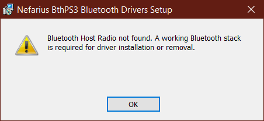

Your Bluetooth stack is not working or not available. If you are on a laptop, make sure wireless is not disabled (physical switch or key combination—depends on the model). On a desktop, ensure a Bluetooth dongle is plugged in. If you had ScpToolkit, AirBender, or similar solutions installed, remove them completely and use stock drivers. If you do not see the Bluetooth icon in the taskbar, Bluetooth is likely off or not working. Fix the Bluetooth stack and run setup again.

## How do I fix "previous version found" on reinstall?

If you see this setup error:

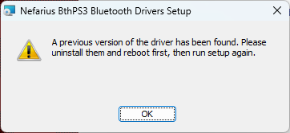

and cannot get past it, do the following:

1. Open **Command Prompt**, **PowerShell**, or **Terminal** as Administrator.
   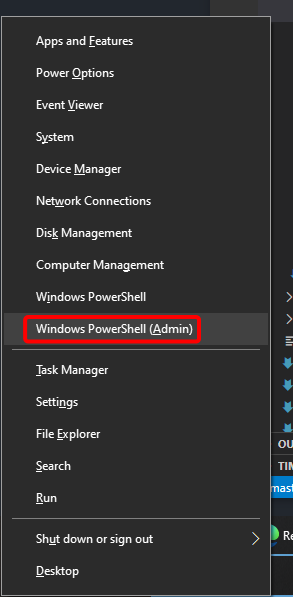
2. Change to the folder where you downloaded the setup (for example, `F:\Downloads`). Replace the path with your own:
   - `cd "F:\Downloads\"`
   - Example: `cd "C:\Users\<YourUsername>\Downloads"`
3. Run the setup with the bypass flag (replace the version number to match the MSI you downloaded):
   - `.\Nefarius_BthPS3_Drivers_x64_arm64_vx.x.x.msi FILTERNOTFOUND="1"`

The setup should then launch. Follow the installer instructions to complete.

## How do I fix "setup wizard ended prematurely"?

That message is the generic MSI abort. The useful error is a few lines above it in the setup log. Typical causes, in the order we see them:

- **Bluetooth Host Radio not found** — the stack is missing or stopped. See [How do I fix the "Bluetooth Host Radio not found" setup message?](#how-do-i-fix-the-bluetooth-host-radio-not-found-setup-message).
- **Previous version / filter not found** — leftover state from an older install. See [How do I fix "previous version found" on reinstall?](#how-do-i-fix-previous-version-found-on-reinstall).
- **Unsupported transport (error 9004)** — **BthPS3 v3.0.0 and newer** refuse to install when the host radio is neither USB nor BTHX/BthMini. Setup exits without changing anything. See [How do I fix setup error 9004?](#how-do-i-fix-setup-error-9004).
- **Radio restart timed out (error 9002)** — on **BthPS3 v2.x**, only **USB** radios can be restarted; UART or I²C hosts fail here. On **v3.0.0 and newer**, USB radios are still hot-cycled, while BTHX/BthMini radios (for example Intel PCIe `iBtPciBus`) are re-enumerated instead. A timeout is expected if they cannot come back online without a reboot. See [How do I fix setup error 9002?](#how-do-i-fix-setup-error-9002) and [What Bluetooth hosts are supported?](#what-bluetooth-hosts-are-supported).
- **Helper tools missing mid-setup** — if the log says a file under `C:\Program Files\Nefarius Software Solutions\BthPS3\nefcon\` could not be started, security software often deleted it during install. Exclude that folder (and the downloaded MSI) from real-time scanning and run setup again.

If Device Manager already shows a yellow mark on the Bluetooth host, jump to [error codes 19, 31, 37, 39, or 43](#how-do-i-fix-bluetooth-device-error-codes-19-31-37-39-or-43).

## How do I fix setup error 9004?

!!! info "BthPS3 v3.0.0 and newer"
    This check was added in v3. Older setup does not show error 9004.

You may see:

> The detected Bluetooth host radio is not attached via a supported transport (USB, or BTHX/BthMini for select non-USB radios such as Intel PCIe iBtPciBus). Installing the drivers would not work and could leave your Bluetooth stack in a broken state. Setup will now exit without making changes.

Setup refused to install because the host radio is neither USB nor a BTHX/BthMini radio. **Nothing was changed** on the machine—you can close setup and keep using Bluetooth as before.

To confirm the transport, open **Device Manager**, find the Bluetooth radio, then **Properties** → **Details**:

- If the enumerator is `USB`, the radio is supported on every current BthPS3 version.
- If **Compatible IDs** contain `MS_BTHX_BTHMINI`, or the device **Service** is `BthMini`, the radio is supported on **BthPS3 v3.0.0 and newer**.
- Anything else is unsupported. Use a USB Bluetooth dongle, or a radio Windows binds to `BthMini.sys`. See [What Bluetooth hosts are supported?](#what-bluetooth-hosts-are-supported).

## How do I fix setup error 9002?

You may see:

> Radio online detection timed out. This error can be misleading on some systems (using Intel Wireless), and is expected on BTHX/BthMini-based radios (e.g. Intel PCIe iBtPciBus), which cannot be power-cycled without a reboot. Choosing Ignore lets setup finish; a reboot will then be required to fully load the driver.

This happens when setup registers the filter and then cannot confirm that the Bluetooth radio came back online.

- **USB radios:** choose **Retry**. If it keeps failing, run setup again and pick the **Legacy sequential** method, then reboot.
- **BTHX/BthMini radios (BthPS3 v3.0.0 and newer):** a timeout is expected. Choose **Ignore**, finish setup, and **reboot** before pairing a controller. The filter loads after the reboot.
- **Abort** ends setup with an error.

See [How to Install](How-to-Install.md) for the method selection screen.

## How do I fix Bluetooth device error codes 19, 31, 37, 39, or 43?

If you have a damaged or partial installation, the setup or uninstaller may not run. If Device Manager shows a yellow exclamation mark on your Bluetooth host with an error code such as:

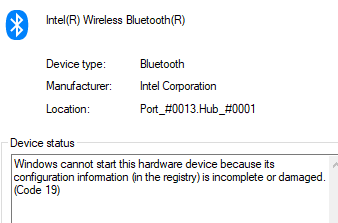

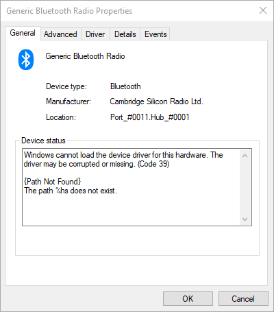

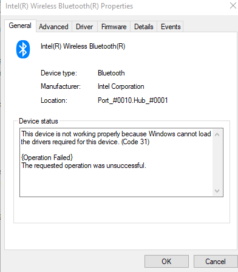

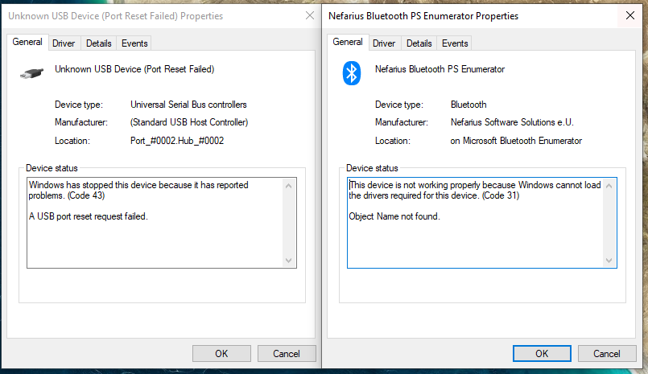

you can try the following fix.

Open **PowerShell as Administrator** and run:

!!! example "PowerShell"
    ```PowerShell
    Remove-ItemProperty -Path 'HKLM:\SYSTEM\CurrentControlSet\Control\Class\{e0cbf06c-cd8b-4647-bb8a-263b43f0f974}' -Name 'LowerFilters'
    ```

This removes the filter driver requirement that may be blocking the radio from starting. Then power-cycle the Bluetooth radio or reboot. You may also need to uninstall and reinstall BthPS3 to fully resolve the issue.

## What to do about error Code 10 (`STATUS_DEVICE_POWER_FAILURE`)

> This device cannot start. (Code 10)

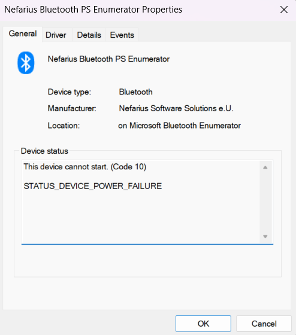

Your Bluetooth host dongle or card is too old or incompatible. There is no software fix; you will need to use a different Bluetooth host.

### What about Code 10 "The specified request is not a valid operation for the target device"?

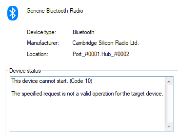

Your Bluetooth host is incompatible with BthPS3. There is no software fix; use a different Bluetooth host.

## What Bluetooth hosts are supported?

In short: most hosts from the last decade that run stock drivers (no ScpServer/ScpToolkit, no AirBender). For a list of tested devices, see [Compatible Bluetooth devices](Compatible-Bluetooth-Devices.md).

!!! note "BthPS3 v2.x"
    Only Bluetooth host radios that use **USB** are supported. This includes most external dongles and many integrated cards. Hosts that use I²C or UART (for example, on Raspberry Pi or Steam Deck) are **not** supported.

!!! info "BthPS3 v3.0.0 and newer"
    USB radios remain supported. In addition, radios attached via Microsoft's Bluetooth Extensibility Transport (BTHX) and bound to `BthMini.sys` are supported—for example, Intel PCIe `iBtPciBus`. UART or I²C radios that Windows does **not** expose as BTHX/BthMini are still unsupported.

To check a non-USB radio yourself, open **Device Manager**, find the Bluetooth radio, then **Properties** → **Details**, and look for:

- Compatible IDs containing `MS_BTHX_BTHMINI`, or
- the device service name `BthMini`

If neither is present, **v3** setup will refuse to install (see [error 9004](#how-do-i-fix-setup-error-9004)).

## What controllers are supported?

!!! important "TL;DR"
    Genuine Sony hardware is the target; third-party controllers may or may not work.

These drivers are designed for the **original Sony SIXAXIS/DualShock 3** (and Navigation and Move) controllers within the limits of the Microsoft Bluetooth stack. Many third-party and clone DualShock 3–compatible devices exist; some behave like the original, others do not. Aftermarket devices often spoof the hardware identification that Windows sees, so there is no reliable way to guarantee support for all of them. For more detail, see [About controller compatibility](About-Controller-Compatibility.md).

## The controller tries to connect, then BthPS3 drops it

BthPS3 identifies PlayStation peripherals by the **Bluetooth remote name**, not by USB-style VID/PID. The name must be present and must match a supported list (SIXAXIS, Navigation, Motion, or Wireless Controller). Details and the registry lists are on [Driver Configuration Utility Explained](Driver-Configuration-Utility-Explained.md).

If a trace shows an empty name (`name:` with nothing after it) followed by `not identified or denied, dropping connection`, the device did not advertise a name. That is a firmware or radio problem on the controller (common with clones). There is no software override that makes a nameless device connect reliably. See [About controller compatibility](About-Controller-Compatibility.md).

## Can I use my wireless keyboard, mouse, or headphones with BthPS3?

Yes. BthPS3 **extends** the existing Windows Bluetooth stack; it does **not** replace it (unlike ScpToolkit and similar tools). Your normal Bluetooth devices keep working. The trade-off is that BthPS3 cannot fully mimic the original PlayStation Bluetooth stack, but you retain standard wireless functionality.

## Can I use other wireless controllers alongside the DualShock 3?

Yes. Any PC-compatible Bluetooth device works with BthPS3. You can use a DualShock 3 over Bluetooth at the same time as other wireless controllers.

## How many devices can I connect at the same time?

There is no fixed limit. It depends on your Bluetooth host (quality, antenna, placement) and radio interference. Users have reported up to six controllers connected at once without noticeable delay. You will need to try your own setup to see what works.

## Can BthPS3 emulate another controller (e.g. Xbox One)?

No. BthPS3 only provides the Bluetooth connection so that PS3 peripherals can connect to Windows and stay connected. It does not emulate other controller types. For that, use a companion solution such as [DsHidMini](../DsHidMini/index.md), which you can find on this site.

## Is there noticeable input lag over Bluetooth?

This has not been measured with dedicated equipment. In practice, users do not report noticeable lag. You may perceive a difference compared to USB (better or worse); that can be real or placebo. For most use cases, Bluetooth latency is acceptable.

## Why is the DualShock 4 supported?

DualShock 4 support was added because it is similar to the DS3 at the protocol level and required little extra work. The DS4 works on Windows without custom drivers when paired in "PC mode" (PS + Share held until the light bar flashes). By default it uses "PS mode" (PlayStation Bluetooth), which BthPS3 can emulate. This mainly enables experimentation for developers who want to talk to the device the way the PlayStation does.

## How do I uninstall BthPS3?

If you no longer need BthPS3 or you see this setup message:

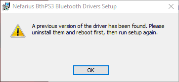

Go to **Settings** → **Apps** → **Apps & features**, find BthPS3, and uninstall it:

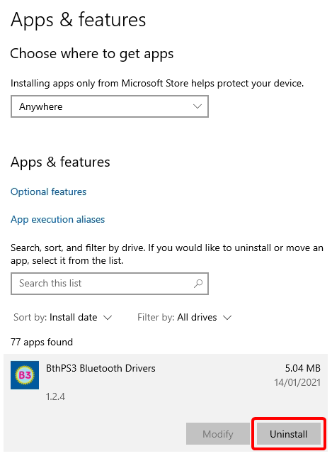

Follow the uninstaller instructions to complete removal.

## Why does BthPS3 not work on the Raspberry Pi 4?

On [Windows on Raspberry](https://worproject.com/), installing BthPS3 leads to error **Code 31** in Device Manager:

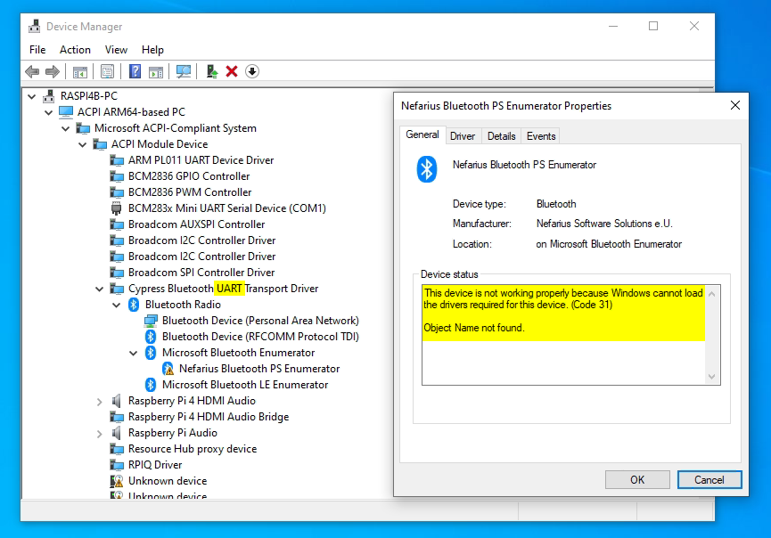

The parent device uses **UART** for Bluetooth and is **not** exposed through BTHX/`BthMini`. BthPS3's filter attaches only to USB radios, or (from **v3.0.0**) to radios Windows binds to `BthMini.sys`. A raw UART host does not qualify, so BthPS3 cannot run on the Raspberry Pi 4 unless that radio later shows up as BTHX/BthMini.

## Can I install BthPS3 on the Steam Deck?

No. The Steam Deck's Bluetooth radio is UART and is not exposed through BTHX/`BthMini`, so it is unsupported for the same reason as the [Raspberry Pi 4](#why-does-bthps3-not-work-on-the-raspberry-pi-4).

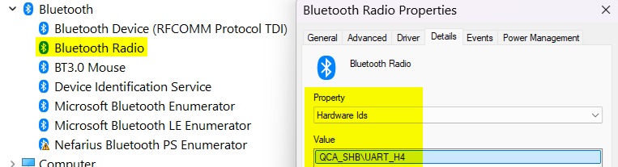
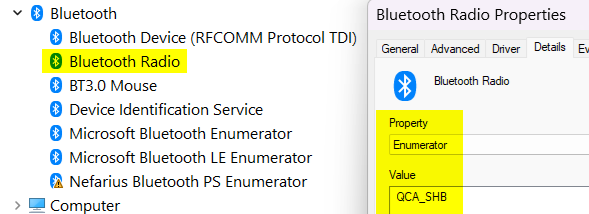

## Why does the driver stop working after turning Bluetooth off and on, or after sleep/hibernate?

With **Intel(R) Wireless Bluetooth(R)** (common on laptops), you may see:

```text
This device cannot start. (Code 10)

STATUS_DEVICE_POWER_FAILURE
```

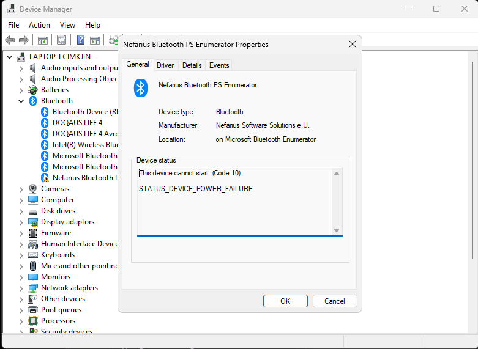

This can happen after waking from sleep or hibernate, or after turning Bluetooth off and on in Windows:

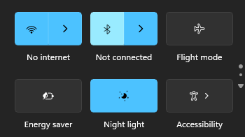

The profile driver then shows a yellow exclamation mark in Device Manager:

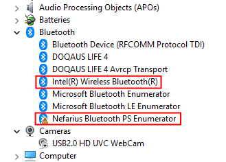

**This is an Intel Wireless issue and cannot be fixed by BthPS3.** To avoid it, do not turn Bluetooth off and on during use, or use a different Bluetooth host.
