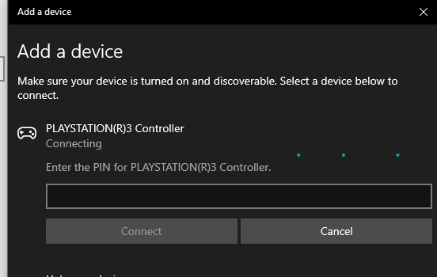
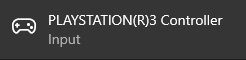
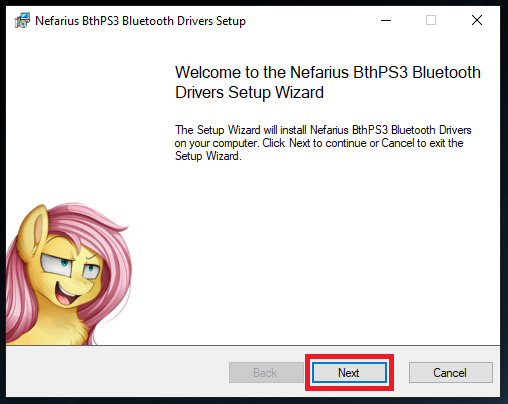
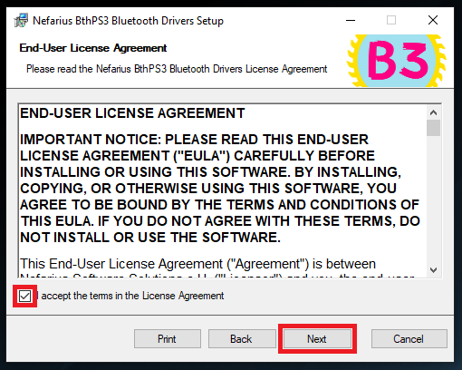
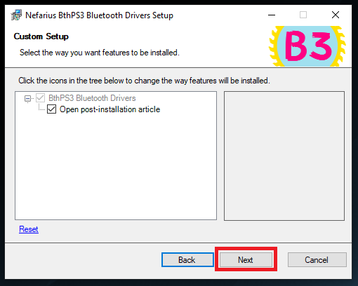
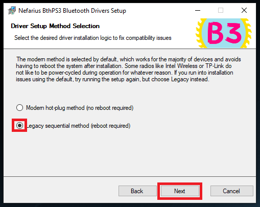
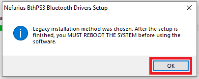
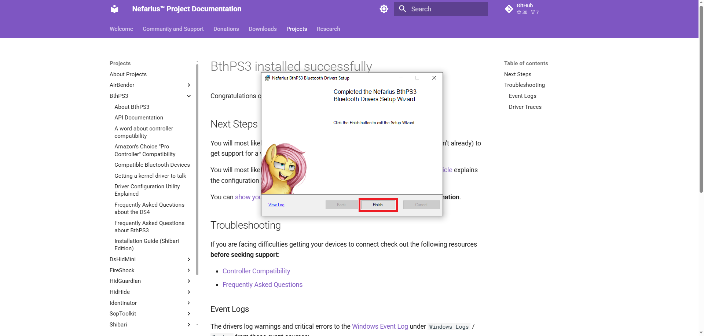

# How to Install

## Before You Begin

- This set of drivers has been designed for and tested with the original Sony PlayStation **3** peripherals—SIXAXIS, DualShock, and Navigation controllers. If your controller works, great; if it does not, please do not contact support, as there is nothing we can do.
- **Do not** attempt to pair a PS3 controller on Windows via the built-in device discovery dialog:  
  

  This will **not** work and can cause Bluetooth connection to fail completely. If you have already done this, open the Bluetooth Settings page in Windows and check the list for entries similar to:  
    
  

  Select the entry and click **Remove device**.
- For the setup to work correctly, **Windows UAC must be enabled**. If in doubt, see [how to turn User Account Control on or off in Windows](https://articulate.com/support/article/how-to-turn-user-account-control-on-or-off-in-windows-10).

## Installing BthPS3 Drivers

!!! note "Bluetooth setup only"
    The following steps are only required if you plan on using your PS3 controller wirelessly over Bluetooth. If you just plan on using a USB cable, then all you need is [DsHidMini](../DsHidMini/index.md).

- If the DsHidMini installation wizard downloaded the BthPS3 installer for you, look for it in your **Downloads** folder—it should be named `Nefarius_BthPS3_Drivers_x64_arm64_vx.x.x.msi` (the x's represent the version number). Otherwise, download it from the [BthPS3 GitHub Releases page](https://github.com/nefarius/BthPS3/releases).
- Double-click the installation file to start the Installation Wizard, then click **Next**.  
  
- On the **End-User License Agreement** screen, read the agreement, check the box to accept the terms, then click **Next**.  
  
- The next screen shows which drivers will be installed. **BthPS3 Bluetooth Drivers** and **Open post-installation article** are selected by default. Leave them checked and click **Next**.  
  
- Choose **Modern hot-plug** or **Legacy sequential**. The modern method does not require a restart but does not work for all Bluetooth receivers; the legacy method should always work but requires a restart. Click **Next**.  
  
- When the UAC prompt appears, click **Yes**. If you do not see it, check the taskbar for a shield icon.  
  
- If you chose the Legacy method, you will be prompted to reboot. Click **OK** (you can restart at the end).  
  
- After installation, a webpage will open with important information. Read it, then click **Finish** to close the wizard. Restart your computer if required.  
  

**Congratulations!** BthPS3 is now installed. Plug in your controller via USB to pair it for Bluetooth—this is the only supported way to pair your controller.
