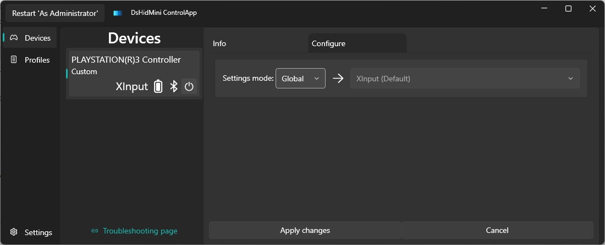

# Welcome to Version 3 Beta Testing

Ahoy there! 👋 If you can read this you're most probably part of the DsHidMini Version 3 Beta crew, welcome!

Please read this article thoroughly before continuing to use the software or asking questions about it.

## Participation rules

The dev team is small, like, *really* small, so we have no time for any BS. If you want to help us find and fix bugs, some rules are inevitable or the ride won't be any fun.

- Participating in a Beta implies you are somewhat comfortable with advanced Windows/PC usage and able to solve problems on your own. **Do not use the Beta releases if you just want to get gaming ASAP, use the stable version 2 releases instead!**
- Before asking questions about what new features are available or which bugs were fixed **check both the [open](https://github.com/nefarius/DsHidMini/milestone/7) and [closed](https://github.com/nefarius/DsHidMini/milestone/7?closed=1) issues and PRs on GitHub** first! We know reading is annoying but so is repeating answering the same questions over and over again to us.

## Make sure to have the new ControlApp tool

Version 3 uses a completely different configuration system so the old `DSHMC.exe` **can not be used with version 3**.

- You can download the latest build of the new control app [from here](https://buildbot.nefarius.at/builds/DsHidMini/latest/bin/ControlApp.exe)
   - You don't need to have the ControlApp open for DsHidMini to work. Only use it to monitor and configure DsHidMini controllers, so keep it in a convenient location for easy access
    - ControlApp requires the **.NET Desktop Runtime 8** to be able to run. To check whether you already have it, simply try opening the ControlApp — It will either open normally or prompt you to install [.NET Desktop Runtime 8](https://dotnet.microsoft.com/en-us/download/dotnet/8.0)

## Important facts

- The mandatory redirect to this page will **NOT** be removed until a stable public release becomes available.
- The documentation in this site for Version 3 is still being built.
- **Manually check for updates regularly** while the auto-update infrastructure is still being built:
    - Check for new [pre-releases](https://github.com/nefarius/DsHidMini/releases) of the driver setup.
    - Check for new builds of [the control app](https://buildbot.nefarius.at/builds/DsHidMini/latest/bin/).

👉 You can follow development progress and chats about the solution on our Discord. I leave finding it as an exercise to the user 😉

## Removal

Check the dedicated [V3 BETA installation/removal page](../v3/How-to-Install.md#removal)
