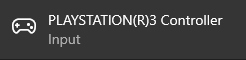

# Frequently Asked Questions

!!! danger highlight "There is another FAQ for wireless"
    If you're facing wireless connection issues [check out the BthPS3 FAQ](../../BthPS3/Frequently-Asked-Questions.md) as well!

## XInput? DS3? DS4? What are you talking about?

!!! note "Know the terms"
    - The controller shipped with the Sony PlayStation 3 👉 DualShock 3 (**DS3**)
    - The controller shipped with the Sony PlayStation 4 👉 DualShock 4 (**DS4**)
    - **Xbox 360** controller 👉 **XInput** (compatible) controller/device
    - **Xbox One** controller 👉 **XInput** (compatible) controller/device

## What is DsHidMini?

Check out the repository [README](https://github.com/nefarius/DsHidMini/blob/master/README.md) and the [main project page](../index.md).

## I am already using ScpToolKit / MotionInJoy / Shibari / Whatever, should I move to DsHidMini?

That is entirely up to you of course 🙂 Do you wish to stick with abandoned, outdated, unmaintained, complex and potentially untrustworthy software that will work less and less the further Windows and Games advance, or do you want to step into the light and use fresh, stable, thought-through open software that simply delivers what it promises? Your call 😉

## How do I use it?

- Follow the [_How to Install_ guide](How-to-Install.md)
- Learn about the different [DsHidMini HID Device Modes](HID-Device-Modes-Explained.md) your controller can be, the characteristics of each mode and how to change between them.

After DsHidMini is active and the controller connected, all you need is to change to the mode best suited to your use case. Keep in mind that if you want to use your controller as a **XInput** (Xbox 360) or **DualShock 4** controller, [there are a few extra steps left to be followed](#how-do-i-use-my-controller-as-a-xbox-360-or-dualshock-4).

## Does my fake PS3 controller work with DsHidMini?

Short answer: it depends. Long answer: [it depends](../../BthPS3/About-Controller-Compatibility.md) 🙂 This is community software with no ties to any hardware manufacturer, all we can provide is knowledge based on research and reverse engineering.

## What are the HID Device Modes? Which one should I use?

Go back to the [_How do I use it?_](#how-do-i-use-it) question.

## What does my controllers' LED represent? How do I quickly disconnect the controller on Bluetooth?

Read the [_Features_ section](https://github.com/nefarius/DsHidMini#features) of the main GitHub page of DsHidMini.

## How to fix `Device Timeout`?

> This device cannot start. (Code 10)
>
> {Device Timeout}
> The specified I/O operation on %hs was completed before the time-out period expired.

This is a known issue that can happen in some occasions. By the time of writing, **no known fix exists**.

## How do I use my controller as a Xbox 360 or DualShock 4?

### Recommended method

Set the controller to `DS4Windows Mode` and use it with **Ryochan7's DS4Windows**. For more detailed instructions and other information, follow the [_DS4Windows Mode User Guide_](DS4-Mode-User-Guide.md) and you'll be good to go.

### Alternative methods

If, for whatever reason, you don't want to use DS4Windows and prefer to choose your own remapping tool, then you have the following options:

- **Using the Controller in `SXS Mode` + Steam:** Steam will detect the controller as an official PlayStation 3 controller as long as `PlayStation configuration support` is enabled. XInput and DS4 emulation are then done automatically according to what Steam thinks the game supports.

- **Using the controller in `SDF or GPJ Mode` + another remapping software:** in `SDF/GPJ Mode` the controller is presented as a generic gamepad which can then be used with remapping tools like x360ce, UCR etc.

## What is the best way to use my controller in games/emulators?

The answer is: _**it depends**_.

You need to verify which `Input API` is supported in whatever you are using and if you want to use DS3 specific functions, like pressure buttons or motion controls. The following table should help you:

| "I want to..." | How to use your DS3 (recommendation) | Notes |
| :---: | :---: | :---: |
| Play modern PC games | `XInput` or `DualShock 4`  | Check the [_How do I use my controller as a Xbox 360 or DualShock 4?_ section](#how-do-i-use-my-controller-as-a-xbox-360-or-dualshock-4). Not all modern games support DS4 controllers, and those that do support it sometimes don't support its rumble |
| Use the DS3 as a common gamepad for most emulators | `XInput` or `GPJ Mode` | The gamepad part of `GPJ Mode` should be compatible with emulators that support only `DirectInput` |
| Use RetroArch | `XInput` | Though RetroArch does support `DirectInput`, its rumble support is currently broken. `XInput` should be used instead to have working rumble |
| Use RPCS3 | `SXS Mode` | Check the [_How do I use DsHidMini with RPCS3?_ section](#how-do-i-use-dshidmini-with-rpcs3) |
| Use the DS3 in PCSX2 with pressure buttons | `SDF Mode` | Check the [_How do I set the controller's pressure buttons in PCSX2?_ section](#how-do-i-set-the-controllers-pressure-buttons-in-pcsx2) |

## How do I use DsHidMini with RPCS3?

<iframe id="odysee-iframe" width="560" height="315" src="https://odysee.com/$/embed/2021-02-27-18-44-37-DsHidMini-Demo-RPCS3/f5d837639dd8bb598c7dad1bcb641a1c0bf74b03?r=EF18PBBCqrYYikMYYk7Gkq32SAU7j8H1" allowfullscreen></iframe>

It's recommended that you use your DS3 controller in `SXS Mode` and then choose on RPCS3's controller settings the `DualShock 3` Handler. When doing so, RPCS3 should automatically pick and set your DS3, with full support to all its functions including LEDs, pressure buttons and motion.

## How do I set the controller's pressure buttons in PCSX2?

<iframe id="odysee-iframe" width="560" height="315" src="https://odysee.com/$/embed/2021-03-08-DsHidMini-SDF-mode-explained-with-PCSX2-v1.7.0/58d0da939bc131bda6f9e2aea60952c5fedcef81?r=EF18PBBCqrYYikMYYk7Gkq32SAU7j8H1" allowfullscreen></iframe>

The recommended method is the following:

- Set the controller into `SDF Mode`
- Go to PCSX2 input settings
- Make sure `DirectInput` is activated at the `Game Devices APIs` options (**DO NOT CHECK** the `DualShock 3 native mode` box)
- Open ControlApp and check the `Mute digital pressure buttons` checkbox
- Back to PCSX2 input settings, on the `Pad X` tab, **configure everything EXCEPT** **L3** / **R3** / **Start** / **Select** / **Analog** / **Mouse**
- Go into ControlApp and uncheck the `Mute digital pressure buttons`
- Finish setting the L3 / R3 / Start / Select buttons. The `Analog` and `Mouse` buttons are not necessary
- At the `Add Force Feedback Effect` select your DS3 controller
  - Only `Constant Force` is required/supported, don't select any other effect, it will not work
- Finish by clicking on `OK`

## How do I use the motion sensors with emulators?

The only emulator that can use the DS3 motion sensors is the RPCS3 emulator when using the DualShock 3 handler.

For now, **it's impossible to use the controller's motion with other emulators**, like CEMU, Yuzu, Dolphin etc. The reason for this is that the PS3 controller only has 1 gyroscope, while modern controllers have 3 gyros. While it's possible to "emulate" the missing gyros by using the sensors it does have, the whole process involves many _maths_ that are not implemented at the moment and are at the very bottom of DsHidMini's To-Do list.

## I did everything right and it just won't connect via Bluetooth!

**Triple-check** that you didn't attempt "conventional pairing" in the past, if you did so **the controller will never ever successfully connect**, no matter what you do. To check this, open the Bluetooth Settings page within Windows and check the list for entries similar to:

Select it and click the "Remove device" button. Then properly pair it once by plugging it into USB, unplug and press the PS button. Should all work now!

Another hint would be if you see an active connection in the notifications panel, but the controller doesn't appear in ControlApp:

## I installed everything but the controller doesn't appear in Device Manager, Devices and Printers or the control app!

You do not have a SIXAXIS/DualShock 3 device then. To verify, plug in your device via USB, get the tool [DevManView from NirSoft](https://www.nirsoft.net/utils/device_manager_view.html) and search for `USB\VID_054C&PID_0268` like so:

If you can not find at least one match **you do not have a DS3 and DsHidMini will not work**. End of story. No, support can not help you with that. Accept it.

This is a DS3:

These are *not*:

Neither are the DualShock **4** nor the DualSense. I am baffled that this is apparently _really hard_ to understand 🤦‍♂️

### I checked the hardware ID, it matches but it still does not work!

In very rare cases Windows might have installed the driver but is not loading it onto the controller device. You can force Windows to do that:

- Find the `USB Input Device` node with the mentioned hardware IDs in Device Manager
- Open Properties, on the `Driver` tab, hit `Update Driver`
- Follow this sequence of choices in the upcoming wizard:
  
  
  
  
- After that DsHidMini has been loaded successfully! Repeat on subsequent controllers if necessary.

## How can I check if my DualShock 3 is genuine?

Short answer: you probably can't. Long answer: [read this](https://github.com/nefarius/DsHidMini/discussions/166).

## I'm having "X" problem when using DsHidMini, what should I do?

- **Trouble when installing DsHidMini or connecting your controllers to the computer:** check the [_How to Install Troubleshooting_ section](How-to-Install.md#troubleshooting)
- **Controller works normally most of the time but have random button presses or buttons fail to register:** most likely a hardware fault, not related to DsHidMini
- Figure it out yourself 👍 There isn't always someone available in life to hold your hand 💪
