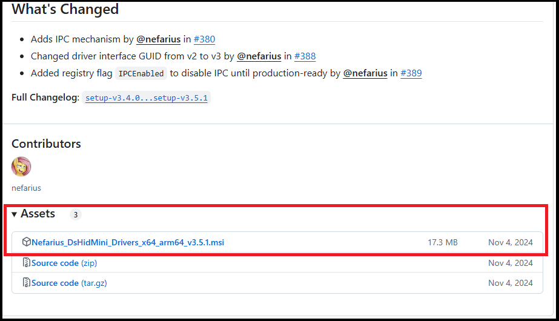
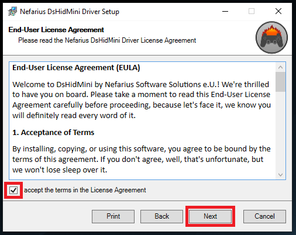
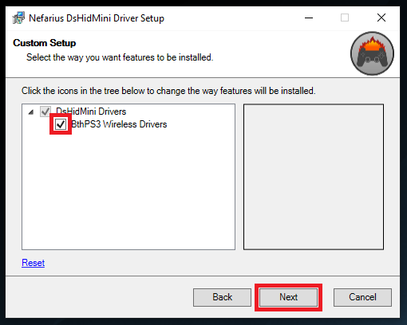
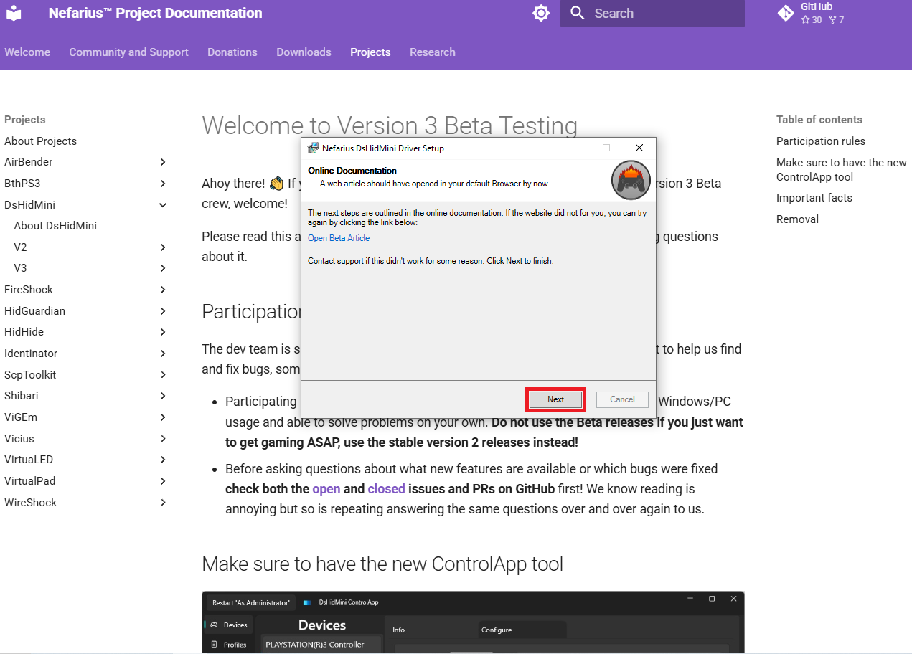

# How to Install

## - Before You Begin:

- DsHidMini was designed to work with Official Sony PS3 DualShock 3 controllers. Most DualShock 3 controllers sold online these days are not original controllers. It can be difficult to tell these fake controllers apart from their original counterparts as they are made with the same molds and have the same symbols and labels on them as official DualShock 3 controllers. These fake controllers might be missing some features (such as motion controls or pressure-sensitive buttons) and most likely will not work with DsHidMini.  If your non-official controller does work, take it as a win.  However, if it does not, please do not contact support as there is nothing we can do.

- Do *not* attempt to pair a PS3 Controller on Windows via the built-in device discovery dialog, like:  
  
This will **not work** and can cause Bluetooth connection to fail completely.  
To check if you did, open the Bluetooth Settings page within Windows and check the list for entries similar to:  

  
If you see this, simply select it and click the "Remove device" button.

- **Make sure your UAC is enabled!** Follow the instructions listed [here](https://articulate.com/support/article/how-to-turn-user-account-control-on-or-off-in-windows-10) if you don't know how to check.  

## - Installing DsHidMini v3:
- Head to the official GitHub page for DsHidMini [here](https://github.com/nefarius/DsHidMini) and click on the link that says "releases".  
  
- The top of the Releases page should show the latest version, which at the time of this writting is v3.5.1 and is currently listed as a "Pre-Release".  
  
- Scroll down a bit and click on the word "Assets" and you will see the installation file named "Nefarius_DsHidMini_Drivers_x64_arm64_vx.x.x.msi" (the x's represent the current version number and may be different from the photo below). Click on that name and download the file to your computer.  
  
- Double click on the file you downloaded in the previous step which will run the Installation Wizard. Click the "Next" button.  
  
- The next screen is the "End-User License Agreement". Read through the agreement and click the box to accept the terms.  Then click "Next".  
  
- The next screen shows what drivers will be installed.  The "DsHidMini Drivers" is selected by default. This is all you need if you intend to use your PS3 controller while connected to your computer using a USB cable. If you want to to use your controller wirelessly over Bluetooth, then you will have to click the box next to "BthPS3 Wireless Drivers". (Note: this will only download the BthPS3 installation file and will need to be manually run later).  Click next.
  
- The UAC window should pop up asking if you are ok with the wizard making changes to your computer. If you don't see it, check your task bar for a shield icon and click that. After clicking "Yes" the installation wizard will continue.
  
- After the DsHidMini Drivers have been installed, a webpage will open with some important information. Please read through it. When done, click "Next", then "Finish" to close the wizard.  
  

**Congratulations!!** DsHidMini is now installed!  

## - (Optional) Installing BthPS3 Drivers:  

Note: The following steps are only required if you plan on using your PS3 controller wirelessly over Bluetooth. If you just plan on using a USB cable, then feel free to skip this section.  

- If you had the DsHidMini installation wizard download the BthPS3 install file for you, you should be able to find it in your "Downloads" folder. It should be named Nefarius_BthPS3_Drivers_x64_arm64_vx.x.x.msi (where the x's represent the current version number). If you didn't (or if for some reason can't find it there), you can download it directly from the official BthPS3 GitHub Releases page [here](https://github.com/nefarius/BthPS3/releases).  
- Double click on the installation file to start the Installation Wizard, then click "Next".
  
- The next screen is the "End-User License Agreement". Read through the agreement and click the box to accept the terms. Then click "Next". 
  
- The next screen shows what drivers will be installed.  The "BthPS3 Bluetooth Drivers" and "Open post-installation article" is selected by default.  Leave those checked and click "Next".  
  
- The next screen asks if you want to use the the "Modern hot-plug" or "Legacy sequential" method to install the drivers. The modern method does not require you to restart your computer, but doesn't work for all Bluetooth receivers.  The legacy method should always work, but requires you to restart your computer afterwards. For the purposes of this guide, I am using the "Legacy" method. Make your choice, then click "Next".  
  
- The UAC window should pop up asking if you are ok with the wizard making changes to your computer. If you don't see it, check your task bar for a shield icon and click that. After clicking "Yes" the installation wizard will continue.  
  
- If using the Legacy Method, you will be told to reboot your computer. Click "OK". (We will restart our computer at the end).  
  
- After the BthPS3 Drivers have been installed, a webpage will open with some important information. Please read through it. When done, click "Finish" to close the wizard. You can now restart your computer.  
  
- **Congratulations!!** BthPS3 is now installed!  

## - Testing Your Controller in Windows  

Now that DsHidMini (and optionally BthPS3) are now installed, your controller should be able to work with Windows.  Perform the following steps to test this:  

- On the lower left corner of your screen where it says "Type here to search" in your task bar, type "joy.cpl", then press ENTER.  
  
- This will open the "Game Controllers" window.  We haven't connected our PS3 controller yet, so this should be blank unless you currently have another controller connected.  
  
- Connect your PS3 controller to your computer with a USB cable. (Note: This will also automatically pair your controller to your computer for Bluetooth if you installed BthPS3). You should now see your controller in the list as "DS3 Compatible HID Device" and a Status of "OK". Click on the controller to highlight it, then click "Properties".  
  
- On the next screen, make sure that the "Test" tab is selected. Now move the joysticks and press each button on your controller to see if everything is working. (Note: Not all button lights will light up. This is normal. As long as a different one lights up each time you press a button, this confirms that everything is working). Click "OK" to exit out of the Properties window.  
  
- To test your controller over Bluetooth (if you installed BthPS3), simply unplug the controller from the USB. The controller should still be listed as "DS3 Compatible HID Device". Then just click on "Properties" and test like before.  (Tip: To turn off your controller while connected via Bluetooth, hold down L1, R1, and the PS Button for 2 seconds.)  

**Congratulations!!** Your PS3 controller has now been set up and verified working on your computer over USB (and optionally Bluetooth).  
