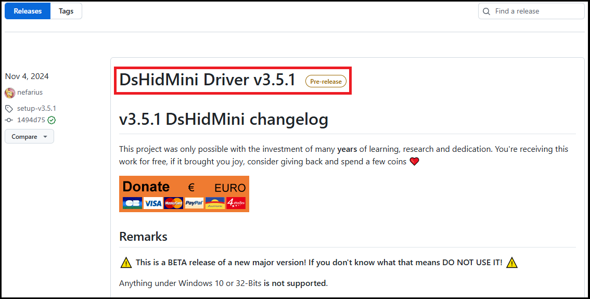

# How to Install/Remove

## Things to Know Before You Begin

!!! danger highlight "DsHidMini V3 BETA installation page!"
    Version 3 is still in BETA. Although all of our tests indicate things are working smoothly, keep in mind that you may encounter unknown issues or features that are missing or yet to be implemented.

    Make sure to check the [intro page for the V3 Beta](../) before continuing!

!!! danger highlight "STOP trying to use DsHidMini with random controllers"
    This and **only** this controller (Sony DualShock 3 a.k.a. PS3 Gamepad) is supported:  
      
    Do NOT contact support for any other device, **it will not work**, no matter how many times you ask!

- DsHidMini was designed to work with Official Sony PS3 DualShock 3 controllers. Most DualShock 3 controllers sold online these days are not original controllers. It can be difficult to tell these fake controllers apart from their original counterparts as they are made with the same molds and have the same symbols and labels on them as official DualShock 3 controllers. These fake controllers might be missing some features (such as motion controls or pressure-sensitive buttons) and most likely will not work with DsHidMini.  If your non-official controller does work, take it as a win.  However, if it does not, please do not contact support as there is nothing we can do.  

- **If you want Bluetooth support** you need to [install BthPS3](../../BthPS3/How-to-Install.md). This can be done either before or after installing DsHidMini.

- For the setup to work correctly **Windows UAC needs to be enabled**. If in doubt, the following page has instructions on how to check its status: [link here](https://articulate.com/support/article/how-to-turn-user-account-control-on-or-off-in-windows-10)   

## Installing DsHidMini v3.x.x

### Driver Installation

!!! note "NOTE" 
    
    Previous versions of DsHidMini required you to uninstall old/outdated software that may cause conflicts.  This is no longer required, so no matter what software you may have preinstalled, the installation steps below are always the same 😀 

- Head to the official GitHub page for DsHidMini releases [here](https://github.com/nefarius/DsHidMini/releases). The top of the Releases page should show the latest version, which at the time of this writting is v3.5.1 and is currently listed as a "Pre-Release".  
  
- Scroll down a bit and click on the word "Assets" and you will see the installation file named "Nefarius_DsHidMini_Drivers_x64_arm64_vx.x.x.msi" (the x's represent the current version number and may be different from the photo below). Click on that name and download the file to your computer.  
  
- Double click on the file you downloaded in the previous step which will run the Installation Wizard. Click the "Next" button.  
  
- The next screen is the "End-User License Agreement". Read through the agreement and click the box to accept the terms.  Then click "Next".  
  
- The next screen shows what drivers will be installed.  The "DsHidMini Drivers" is selected by default. This is all you need if you intend to use your PS3 controller while connected to your computer using a USB cable. If you want to to use your controller wirelessly over Bluetooth, then you will have to click the box next to "BthPS3 Wireless Drivers". (Note: this will only download the BthPS3 installation file and will need to be manually run later).  Click next.  
  
- The UAC window should pop up asking if you are ok with the wizard making changes to your computer. If you don't see it, check your task bar for a shield icon and click that. After clicking "Yes" the installation wizard will continue.  
  
- After the DsHidMini Drivers have been installed, a webpage will open with some important information. Please read through it. When done, click "Next", then "Finish" to close the wizard.  
  

**Congratulations!!** Now that [DsHidMini](How-to-Install.md) (and optionally [BthPS3](../../BthPS3/How-to-Install.md)) are installed with the default settings, your controller should be able to work with Windows and behave as if it were an Xbox Controller (Xinput Device). Continue on with the next section to test this.

### Checking Controller with ControlApp.exe  

!!! note "NOTE"
     ControlApp is a companion application for configuring DsHidMini controllers and does not need to be open for DsHidMini to work. No changes need to be made as the default settings should would just fine.  In this section, it is only being used to verify that DsHidMini is seeing your controller.

!!! note "NOTE"
    ControlApp requires the **.NET Desktop Runtime 8** to be able to run. To check whether you already have it, simply try opening the ControlApp.  It will either open normally or prompt you to install [.NET Desktop Runtime 8](https://dotnet.microsoft.com/en-us/download/dotnet/8.0).  

- Connect your PS3 controller to your computer with a USB cable. (Note: This will also automatically pair your controller to your computer for Bluetooth if you installed [BthPS3](../../BthPS3/How-to-Install.md)).
- Download the latest version of **ControlApp** from [here](https://buildbot.nefarius.at/builds/DsHidMini/latest/bin/ControlApp.exe)
- Double click on the newly downloaded **ControlApp.exe**.
- If you see your controller under "Devices" and it's showing "XInput", then DsHidMini is seeing your controller properly. (If you installed [BthPS3](../../BthPS3/How-to-Install.md), then you can remove your USB cable and see if it shows connected with XInput too).  
  
- Close ControlApp and keep it in a convenient location for easy access later.  

### Testing Your Controller in Windows

- On the lower left corner of your screen where it says "Type here to search" in your task bar, type "joy.cpl", then press ENTER.  
  
- This will open the "Game Controllers" control panel window. Connect your PS3 controller to your computer with a USB cable or Bluetooth. You should now see your controller in the list as "DS3 Compatible HID Device" and a Status of "OK". Click on the controller to highlight it, then click "Properties".  
  
- On the next screen, make sure that the "Test" tab is selected. Now move the joysticks and press each button on your controller to see if everything is working. Click "OK" to exit out of the Properties window.  
  

**Congratulations!!** Your PS3 controller has now been set up and verified working on your computer over USB (and optionally Bluetooth). If it doesn't, try restarting your computer and try again.  If it still doesn't work, then [read on here](How-to-Install.md/#troubleshooting)!  

!!! note "NOTE"
    You can now map your controller in your emulator of choice like you would any other controller. However, to get full controller support in [RPCS3](https://rpcs3.net/) (PS3 emulator) follow this guide [here](RPCS3.md). To get full controller support in [PCSX2](https://pcsx2.net/) (PS2 emulator), follow this guide [here](PCSX2.md).  
    **Happy Gaming!!**

## Updating

If you want to update, simply [follow the same installation steps](#installing-dshidmini-v3xx) and overwrite any existing files. Reboot your machine to be extra safe if it didn't work right away.

## Removal

1. The main Beta v3 driver can be removed by just uninstalling `Nefarius DsHidMini Driver` in Windows' Apps & features
2. BthPS3 can also be uninstalled the same way as above via Apps & Features
3. The ControlApp companion application isn’t installed in the traditional sense and can be deleted like any other file

After that, DsHidMini should be fully gone from your computer 😥

## Troubleshooting

### Verifying if the controller is loading the correct driver

The driver can't do anything if it is not being used, so to check this:

- Connect your controller **by USB** cable
- Open Device Manager by pressing ++win+x++ and select it from the menu
- Search for and expand the category `Nefarius HID Devices`, your controller should appear there. Double click on it to check the driver status:  

If the device appears there but the driver status indicates some error (e.g. `This device cannot start (Error Code 10)`) try pressing the `Reset` button on the back of your controller and then reconnecting it. Rebooting your computer is also worth a shot.

If the controller does not appear under `Nefarius HID Devices` or if this section doesn't exist at all, you probably have another driver taking priority over DsHidMini. To solve this try [uninstalling](#removal) and then [installing again](#installation) DsHidMini version 3.

### Removing conflicting drivers

!!! warning highlight "Always try reinstalling DsHidMini V3 first!"
    You don't need to follow this section manually, just try reinstalling DsHidMini V3 as its installer verifies and removes drivers known to conflict with it.

??? info highlight "Legacy section on conflicting drivers removal (click to expand)"

    We need to first determine if any other conflicting device driver is present on the system and remove it so DsHidMini can take over that job. The steps outlined here may or may not be applicable to your system, it entirely depends on your past 😜 and the stuff you potentially installed. Worry not though, together we shall succeed ✨

    **ScpToolkit**

    If you had ScpToolkit installed, you need to purge every remains from your machine. [Follow this comprehensive removal guide](../../ScpToolkit/ScpToolkit-Removal-Guide.md).

    **Official Sony driver**

    If you have/had PS Now installed, chances are high you have the official Sony `sixaxis.sys` on your system. [Follow this procedure to remove it](../v2/SIXAXIS.SYS-to-DsHidMini-Guide.md).

    **FireShock**

    If you've used [Shibari](https://github.com/nefarius/Shibari) before you probably have FireShock installed. [Follow this procedure to remove it](../../FireShock/Removal-Guide.md).

### DSHMC.exe not detecting DsHidMini V3 controllers

DsHidMini V3 requires the new ControlApp companion tool. Check the [Checking Controller with ControlApp.exe](#checking-controller-with-controlappexe) section on how to get it.

### Controller does not connect by Bluetooth

This section is under construction.
