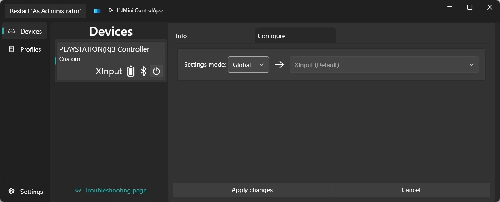

# Major Version 3

## Before proceeding...

- DsHidMini v3 is the current stable release series. If you need to go back, you can always reinstall v2 (this is not a one-way street).
- For ongoing changes and known issues, check both the [open](https://github.com/nefarius/DsHidMini/milestone/7) and [closed](https://github.com/nefarius/DsHidMini/milestone/7?closed=1) issues and PRs on GitHub.

## Highlights

The following features are considered done and have been tested to the best of the abilities of a two-person development team 😉

- Native **Xbox One Controller emulation**
    - Test as many modern games in this mode as you like, [feedback welcome](https://github.com/nefarius/DsHidMini/discussions/114)!
- Full Windows 11 compatibility
    - From now on the driver will be signed by Microsoft
- A new configuration tool, which allows you to:
    - configure LED behavior
    - change/disable the combo used to turn off the controller when wireless
    - adjust the deadzone of the sticks
    - tweak rumble settings
    - etc.
- ARM64 builds of the driver
    - Appears to work fine on Apple Silicon using Windows 11 on Parallels

## Installation, removal and troubleshooting

- [V3 installation and removal](How-to-Install.md)
- [HID Device Modes explained](HID-Device-Modes-Explained.md) — SXS, XInput, DS4Windows, SDF, GPJ
- [XInput mode (default) — setup and Steam](XInput-Mode-Explained.md)
- [DS4Windows mode user guide](DS4-Mode-User-Guide.md)
- [Output rate control (Bluetooth)](Output-Rate-Control-Explained.md)
- [SCP XInput Bridge (proxy DLL for games)](SCP-XInput-Bridge.md)
- [Switch from SIXAXIS.SYS to DsHidMini](SIXAXIS.SYS-to-DsHidMini-Guide.md)
- [Frequently Asked Questions](FAQ.md)
