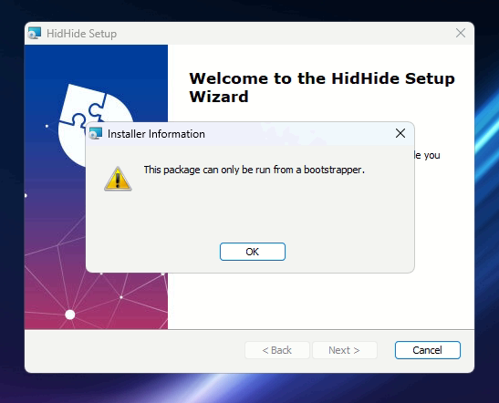

# Frequently Asked Questions

## I have a different question, how can I reach you folks?

[Head over to the support page](../../Community-Support.md), we prefer Discord.

## Can it hide mice, keyboards, touch- or trackpads?

Unfortunately not. Mouse and Keyboard inputs travel through different means and routes through Windows and HidHide's blocking mechanism can not interfere with those in the same fashion as it does with Joysticks and Gamepads.

A major redesign would be required to make this a reality, bear in mind that HidHide is a hobby project so the authors can not make any promises as many other tasks in life have priority. If any developer would be interested in this topic, contact us! 😄

## Where can I download a Windows 7/8 setup?

Thanks to [driver signing](https://learn.microsoft.com/en-us/windows-hardware/drivers/install/driver-signing) restrictions we lack the means and motivation to support anything below Windows 10/11 so these are the only OS editions we support.

## Where can I download a 32-Bit or ARM64 (Mac, RasPi) version?

At this point we only provide a setup for **Intel/AMD 64-Bit** installations. Follow [this issue](https://github.com/nefarius/HidHide/issues/57) for potential news about this topic.

## How to fix 'This package can only be run from a bootstrapper' message?



Simply download and run the latest setup, go through the installation again and you're done.

## I hid my device, but the application can still see it

HidHide's filter driver only attaches to device stacks that are created **after** the driver was registered. If you configured cloaking immediately after installing HidHide, devices that were already enumerated are still running on a stack with no filter attached, so they remain visible even though the configuration looks correct.

Confirm with `HidHideCLI.exe --cloak-state` and `--dev-list`; if the device is listed as hidden but an unauthorized application still sees it, the stack needs rebuilding.

The fix is to force the device stack to be rebuilt. In order of convenience:

**Option 1 — replug the device (simplest).** Unplug the device and plug it back in. This tears down and recreates the whole stack, and cloaking takes effect immediately.

**Option 2 — disable and re-enable the device in Device Manager.** Does the same job without touching the cabling, so it's the practical choice for devices you can't easily unplug. See the walkthrough below.

**Option 3 — reboot.** Achieves the same thing, but it's the slowest route and is rarely necessary — reach for it only if neither of the above is possible.

#### Rebuilding the stack from Device Manager

Note that for a USB HID device, *both* the parent and child nodes appear under **Human Interface Devices** — the parent is not under "Universal Serial Bus controllers", despite having a `USB\...` instance path. The two nodes are typically:

- parent: `USB\VID_xxxx&PID_xxxx\...`, usually displayed as **USB Input Device**
- child: `HID\VID_xxxx&PID_xxxx\...`, e.g. **HID-compliant game controller**

Disabling and re-enabling the **parent** node rebuilds the child along with it.

Be aware that every USB HID device on the system produces an entry named "USB Input Device", so there may be many identical-looking entries. To identify the right one, open its **Properties → Details** tab and check **Bus reported device description**, which shows the real product name (e.g. `TWCS Throttle`). **Device instance path** on the same tab confirms the VID/PID.

Equivalent from an elevated PowerShell prompt, if you already know the instance path:

```powershell
$id = 'USB\VID_044F&PID_B687\7&33565146&0&1'   # your device's parent node
Disable-PnpDevice -InstanceId $id -Confirm:$false
Start-Sleep -Seconds 3
Enable-PnpDevice  -InstanceId $id -Confirm:$false
```

To list candidate parent nodes with their real product names:

```powershell
Get-PnpDevice -Class HIDClass -PresentOnly |
  Where-Object InstanceId -like 'USB\*' |
  ForEach-Object {
    [pscustomobject]@{
      Product    = (Get-PnpDeviceProperty -InstanceId $_.InstanceId |
                    Where-Object KeyName -eq 'DEVPKEY_Device_BusReportedDeviceDesc').Data
      InstanceId = $_.InstanceId
    }
  } | Format-Table -AutoSize
```
