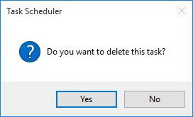
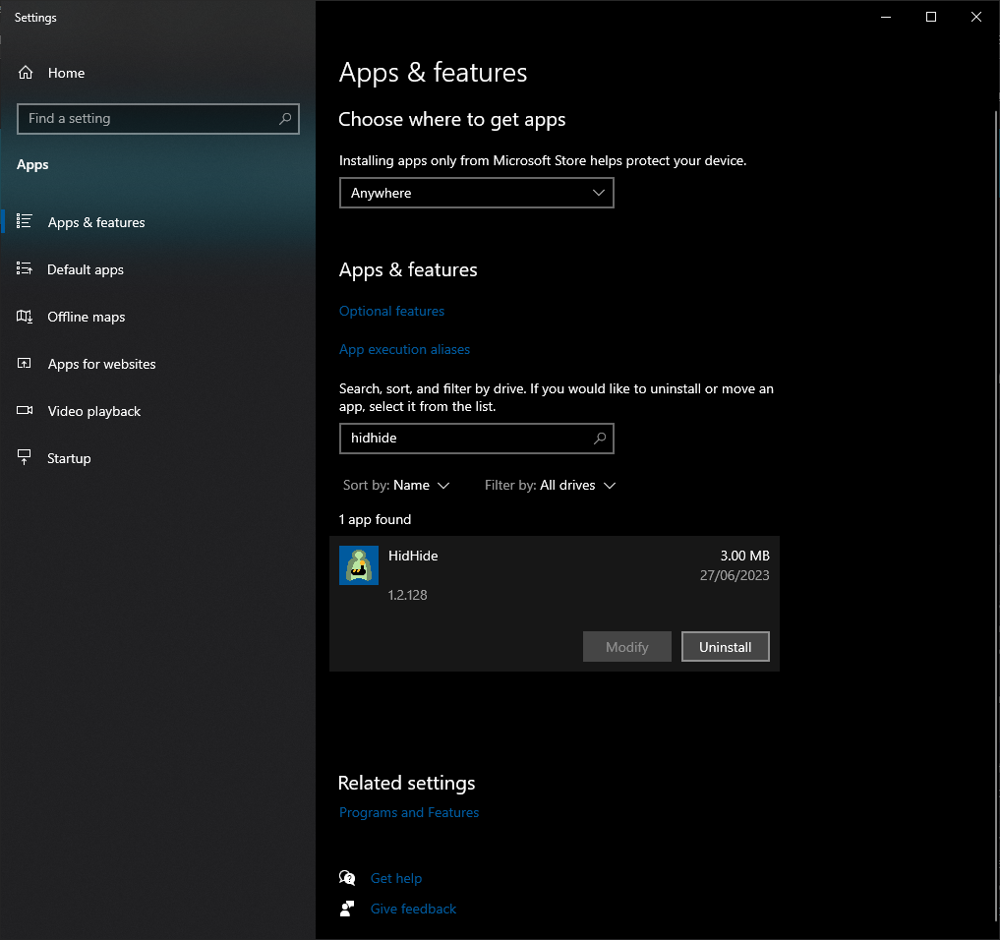

# End of Life Statement

In May 2023 a conflict with a registered trademark by [ViGEM GmbH](https://vigem.de/) was discovered, leading to a mutual agreement between Nefarius Software Solutions e.U. and ViGEM GmbH to enter a transition phase starting July 2023 and ending approximately December 2023. As a result of the agreement, all usage of the phrase "ViGEm" (ViGemBus etc.) and the Domain `vigem.org` will be retired and archived permanently over the agreed upon time span.

Software like ViGEmBus, HidHide and older versions of BthPS3 got shipped with an auto-updater service which periodically establishes communication with a web service hosted under `updates.vigem.org`. **This service will be permanently retired after December 2023**, therefore it is highly recommended to follow the outlined procedures of this article to stop your installation making any further web requests to the to-be-decommissioned web service.

So long, everyone, it was fun while it lasted 😄

## Adjust Automatic Updater Configuration

The software packages mentioned below ship with an automatic updater agent, a little program that runs once a day and contacts a web service configured in a shipped INI configuration file. The updater process is launched via scheduled tasks.

### Configure ViGEm Bus Driver Updater

!!! warning "This is the recommended action if you're running Windows 10/11"
    If you're running ViGEm Bus Driver **v1.21.442 or older** the following section applies to you and is highly recommended to follow until software updates become available (if ever).

Navigate to the path `C:\Program Files\Nefarius Software Solutions\ViGEm Bus Driver` and edit the file `ViGEmBus_Updater.ini` with a text editor of your choice (you will need Administrator permissions to edit). Find the following line:

```ini
URL=https://updates.vigem.org/api/github/ViGEm/ViGEmBus/updates
```

Change it to:

```ini
URL=https://aiu.api.nefarius.systems/api/github/ViGEm/ViGEmBus/updates
```

Save it an you're done! From now on the updater agent will contact the new server to check for software updates.

#### For Windows 7/8/8.1 Users

!!! warning "This is the recommended action if you're running Windows 7/8/8.1"
    If you're running ViGEm Bus Driver **v1.16.116 or older** the following section applies to you and is highly recommended to follow as there won't be any new updates made available.

Find and open "Task Scheduler", select `Task Scheduler Library` on the left-hand side, select the `ViGEmBusUpdater` entry in the center panel, right-click it and select `Delete`:


Confirm and you're done!



From now on your PC will no longer check for updates and no update pop-ups will nag you ever again!

### Configure HidHide Updater

!!! warning "This is the recommended action if you're running Windows 10/11"
    If you're running HidHide **v1.2.128 or older** the following section applies to you and is highly recommended to follow until software updates become available (if ever).

Navigate to the path `C:\Program Files\Nefarius Software Solutions\HidHide` and edit the file `HidHide_Updater.ini` with a text editor of your choice (you will need Administrator permissions to edit). Find the following line:

```ini
URL=https://updates.vigem.org/api/github/ViGEm/HidHide/updates
```

Change it to:

```ini
URL=https://aiu.api.nefarius.systems/api/github/ViGEm/HidHide/updates
```

Save it an you're done! From now on the updater agent will contact the new server to check for software updates.

### Remove BthPS3 Updater Job

!!! warning "This is the recommended action if you're on an older version"
    If you're running BthPS3 drivers **v1.2.4 or older** the following section applies to you and is highly recommended to follow as there won't be any new updates made available via this mechanism.

Find and open "Task Scheduler", select `Task Scheduler Library` on the left-hand side, select the `BthPS3Updater` entry in the center panel, right-click it and select `Delete`:


Confirm and you're done!


From now on your PC will no longer check for updates and no update pop-ups will nag you ever again!

## Uninstall Applications

If you're not using any software relying on either ViGEmBus or HidHide you can simply uninstall them via "Apps & Features". Same can be achieved by the old "Programs and Features" section in the Control Panel.

### Uninstall ViGEm Bus Driver

Search for `ViGEm` and uninstall:


### Uninstall HidHide

Search for `HidHide` and uninstall:



### Uninstall BthPS3

Search for `BthPS3` and uninstall:


Alternatively via `Programs and Features` panel:


Right-click the entry and select `Uninstall`. Follow the steps and you're done.
