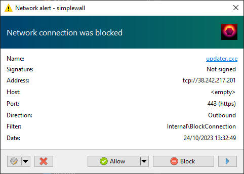
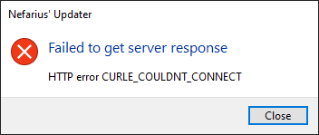
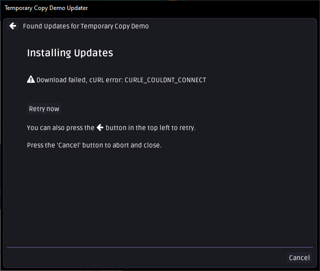
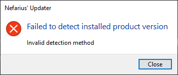
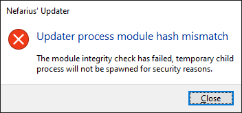

# Common Errors

The updater will try its best to not disturb the user unless absolutely necessary. Some errors can not be recovered from, though, so check out what you can do below.

## Requests blocked by firewall

Typically on vanilla Windows the Windows Firewall does not block any **outgoing** request so everything should be fine.

However if 3rd party software firewalls (like [simplewall](https://www.henrypp.org/product/simplewall)) are used, users might get a notification like...

...and would need to accept the outgoing connection for the core functionality to work.

If the connection is blocked, an error message similar to...

...might appear and needs to be rectified by the user (or the setup package the updater is bundled with). When the server request fails entirely, the process exits with code `104`.

If the source of the update setup file is blocked, you will end up with a view similar to this after the retries and timeouts have been exhausted:

## Invalid detection method

This error can pop up when the updater is run without any silent switches and neither the server nor the local configuration file provided any details on how to detect the version of the product it watches over. The process exits with code `105`.

## Updater process module hash mismatch

This error is a security check that fires when the updater is running as a temporary child process (`--temporary`) and detects that the SHA-256 hash of the parent executable does not match its own. This check exists to prevent an impostor process from loading the updater as a trusted helper. The `--temporary` flag itself is a supported internal mechanism used by the `runAsTemporaryCopy` feature — this dialog means the parent process is not the same binary that spawned the child, which indicates a configuration or security problem.

!!! note "Other incompatible flag combinations"
    Combining `--temporary` with any silent-mode flag (`--silent`, `--background`, `--autostart`, `--silent-update`) is not supported and causes the updater to abort at startup with exit code `112`.

## Signature or checksum verification failed

When a post-download integrity or authenticity check fails (checksum mismatch, invalid Authenticode chain, publisher pin mismatch, or a missing checksum when `--strict-verification` is active), the updater exits with code `116`. All of these failure types currently share this exit code — see [Exit Codes](Exit-Codes.md#reserved--not-yet-individually-emitted) for details on the reserved granular codes.
