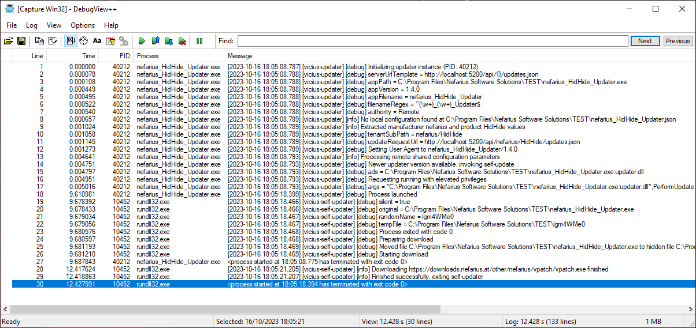

# Logging

Anything that can go wrong will at some point go wrong. When that happens, the updater provides you with a ton of information via [debug logging](https://learn.microsoft.com/en-us/windows/win32/api/debugapi/nf-debugapi-outputdebugstringa), which is always on by default (can be disabled on compilation though; set `NV_FLAGS_NO_LOGGING` in `CustomizeMe.h`).

To observe the live logs I recommend using the tool [DebugView++](https://github.com/CobaltFusion/DebugViewPP) since it offers some nice filtering options and other convenience features.

Alternatively you can also enable [logging to file](Command-Line-Arguments.md#-log-to-file-value) or [raise the log level](Command-Line-Arguments.md#-log-level-value) to get even more detailed outputs.

## Examples

