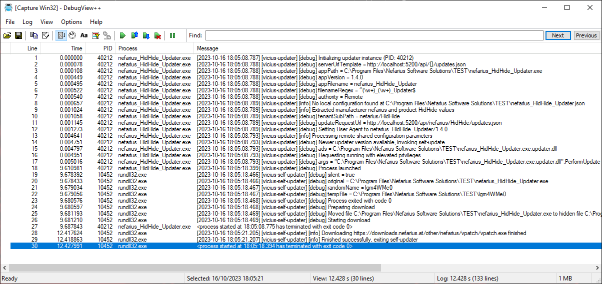
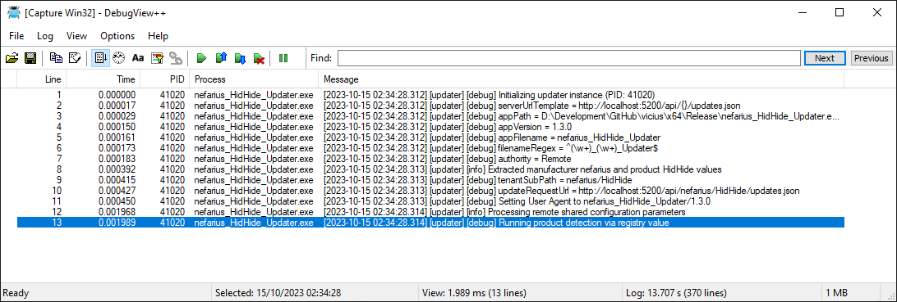
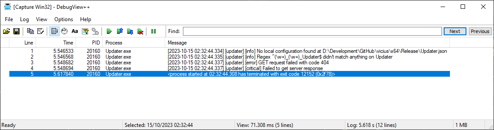
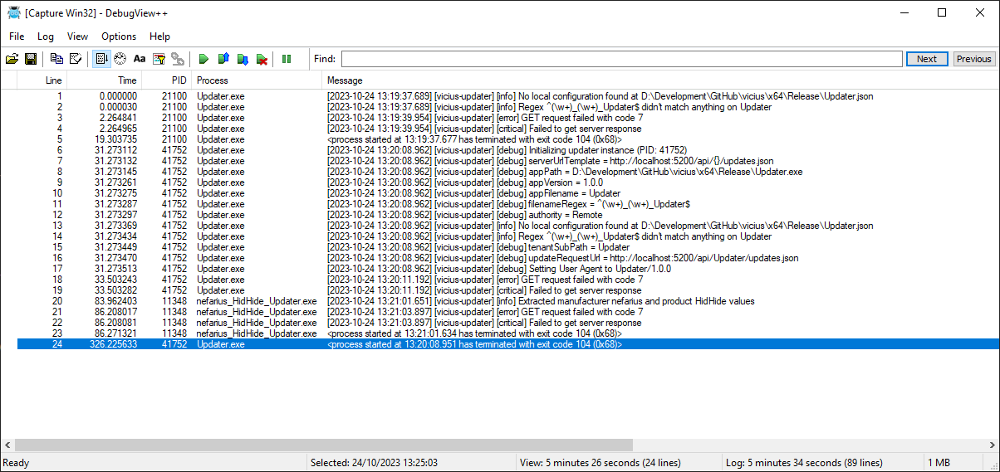

# Logging

Anything that can go wrong will at some point go wrong. When that happens, the updater provides detailed information via [debug output](https://learn.microsoft.com/en-us/windows/win32/api/debugapi/nf-debugapi-outputdebugstringa) using an MSVC/OutputDebugString sink. Logging is enabled by default and can be disabled at compile time by setting `NV_FLAGS_NO_LOGGING` in `CustomizeMe.h` (it is commented out in the default build, so logging is active unless you explicitly opt out).

## Default log level

The default log level is **`info`**. Debug messages (including output from the `log()` callback in [Inja templates](Inja-Templates.md)) require [`--log-level debug`](Command-Line-Arguments.md#-log-level-value); trace messages require `--log-level trace`.

## Observing logs

To observe the live `OutputDebugString` output I recommend using the tool [DebugView++](https://github.com/CobaltFusion/DebugViewPP) since it offers nice filtering options and other convenience features.

Alternatively, you can also enable [logging to file](Command-Line-Arguments.md#-log-to-file-value) to persist the output, or [select a more verbose log level](Command-Line-Arguments.md#-log-level-value) to get more details.

## Examples

