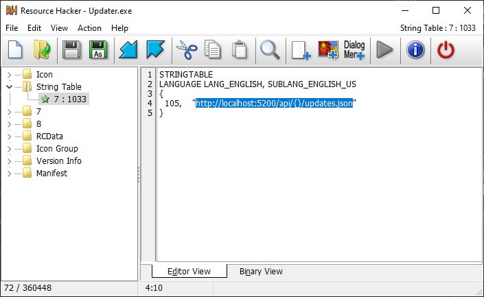

# Server Discovery

The single most important setting that *at least* needs to be customized is the URL to your web server which delivers the update configuration file. The following possibilities are offered to you to choose from.

## Configuration options

### Make your own custom build

Check out the project's source code, edit the `NV_API_URL_TEMPLATE` value in `CustomizeMe.h` and build your very own copy of the updater. Done!

The default templates in `CustomizeMe.h` are:

```cpp
// Release builds
#define NV_API_URL_TEMPLATE "https://vicius.api.nefarius.systems/api/{}/updates.json"

// Debug builds
#define NV_API_URL_TEMPLATE "http://localhost:5200/api/{}/updates.json"
```

The `{}` placeholder is automatically replaced with `manufacturer/product` (extracted from the executable file name via `filenameRegex`) or with `manufacturer/product/channel` when a channel is set (via [`--channel`](Command-Line-Arguments.md#--channel-value) or the `channel` field in the [local configuration](Local-Configuration.md#notable-instance-fields)).

!!! note "Consider signing your executable"
    Consider signing the resulting binary with your (company's) code signing certificate.

### Provide and ship a configuration file

Assuming your final updater executable name being `nefarius_HidHide_Updater.exe` you can create and package a JSON file called `nefarius_HidHide_Updater.json` to be delivered alongside your product setup. As long as the file contents are valid JSON and the name matches the updater executable, that's all you need to do!

!!! example "Minimal nefarius_HidHide_Updater.json example"
    ```json
    {
        "instance": {
            "serverUrlTemplate": "https://vicius.api.nefarius.systems/api/example/updates.json"
        }
    }
    ```

!!! warning "Protect the JSON file properly"
    Make sure to deliver both the executable and the configuration file to a location on the target machine that is not writable to non-elevated users (e.g. some sub-directory of `Program Files` or similar).  
    Bear in mind that any other (malicious) process running in the user context can edit the configuration file if you place the updater in e.g. the `%LOCALAPPDATA%` folder.

### Edit the string table resource

!!! warning "Disabled in stock builds"
    `NV_FLAGS_NO_SERVER_URL_RESOURCE` is **defined (active) by default** in `CustomizeMe.h`. This means the string table resource method is disabled unless you explicitly comment it out. Stock release binaries built from the repository without modification will not read string resource `105` and will use the compiled-in URL template instead.

If you wish to both avoid compiling your own binary and shipping a configuration file, you can use [Resource Hacker](https://angusj.com/resourcehacker/) on the updater executable and edit the string table entry `105` as seen below:



!!! warning "Doing so will break the executable signature"
    If you use this method, beware that this will invalidate the signature of the executable.  
    Consider re-signing the resulting binary, if possible or avoid this method altogether.

## Advanced local configuration options

When using the [local configuration file](Local-Configuration.md) approach, additional `instance` fields give you fine-grained control over server discovery:

- **`fallbackServerUrlTemplates`** — an array of additional URLs tried in order if the primary URL fails.
- **`filenameRegex`** — override the regex used to extract `manufacturer` and `product` from the executable name. Useful if your binary doesn't follow the default `manufacturer_product_Updater` naming convention.
- **`channel`** — sets an update channel name that is inserted as the third segment of the URL template (`manufacturer/product/channel`). Can also be supplied at runtime via [`--channel`](Command-Line-Arguments.md#--channel-value).
- **`network`** — configures proxy, DNS-over-HTTPS, and IP-family preferences.

See [Local Configuration — Notable instance fields](Local-Configuration.md#notable-instance-fields) for full details and available sub-fields.
