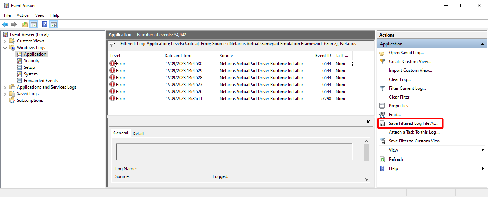

# Frequently Asked Questions

An ever growing collection of frequently asked questions and their respective answers 🙃

## Where to find error details if the installation failed?

Open the `Event Viewer` application. You can find it by e.g. a start menu search like seen here:

Next, expand the node `Windows Logs` and select the `Application` log.

By default, there is way too much information displayed we do not need, so select `Filter Current Log...` on the right-side panel:

On the upcoming dialog, expand the `Event sources` box and check every element prefixed with `Nefarius`:

Click the `Critical` and `Error` event levels so we get less noise:

Now the list should have shrunk down significantly. Now on the right-side panel select `Save Filtered Log File As...`:

Select a location where to store the export file to and when asked about the Display Information, make sure to select `English` languages (may be one or two entries only):

You can now share the generated `.evtx` file and `LocaleMetaData` directory with support personnel. It's best to compress them using e.g. 7zip or WinRAR or similar to have one single file to share.

Good luck!
